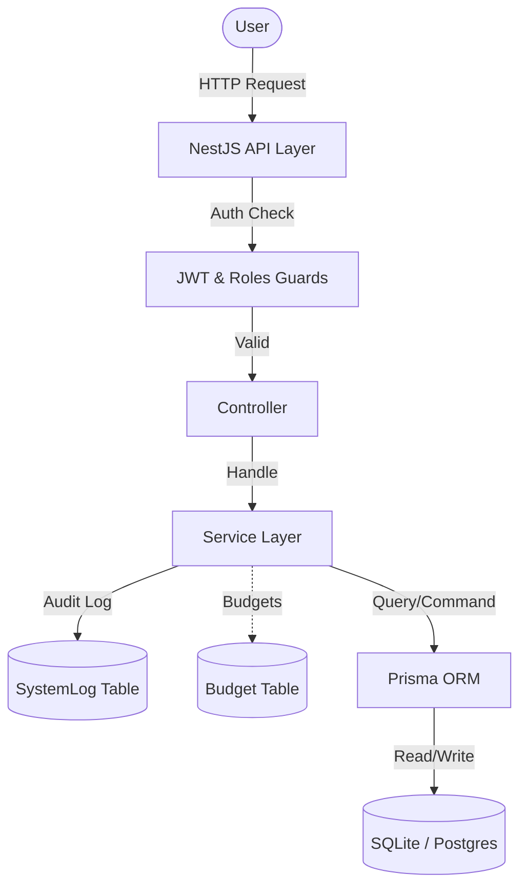
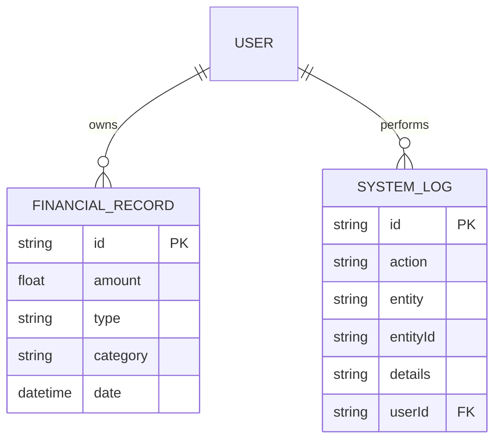

# Architecture

## Folder Structure

```
src/
├── auth/                        # JWT login, register, Passport strategy
├── budgets/                     # Category spending limits engine
├── common/
│   ├── decorators/              # @Roles(), @CurrentUser()
│   ├── guards/                  # JwtAuthGuard, RolesGuard (hierarchical)
│   ├── interceptors/            # ResponseTransformInterceptor
│   └── filters/                 # AllExceptionsFilter
├── dashboard/                   # Analytics aggregation
├── health/                      # Terminus health checks
├── prisma/                      # @Global() PrismaClient wrapper
├── records/                     # Financial records CRUD
├── users/                       # User management & governance
├── app.module.ts                # Root module
└── main.ts                      # Bootstrap + Swagger
```



## Data Relationship Diagram



## RBAC Design

Role hierarchy is numeric:

```
VIEWER = 1 < ANALYST = 2 < ADMIN = 3
```

`RolesGuard` enforces the **minimum** required level. A route decorated with `@Roles(Role.ANALYST)` allows both `ANALYST` and `ADMIN`.

Ownership enforcement for record updates happens in `RecordsService.update()` — not in the guard — to allow the service layer to be framework-agnostic and independently testable.

## Request Lifecycle

1. ThrottlerGuard (rate-limit check)
2. JwtAuthGuard (validates Bearer token, attaches `req.user`)
3. RolesGuard (checks `req.user.role` against `@Roles()` metadata)
4. ValidationPipe (validates + transforms DTO)
5. Controller → Service → PrismaService
6. ResponseTransformInterceptor wraps success response
7. AllExceptionsFilter handles errors

## Design Decisions

| Decision | Rationale |
|----------|-----------|
| NestJS over Express | Built-in DI, Guards, Interceptors, Pipes make RBAC + validation ergonomic |
| Prisma over TypeORM | Type-safe, schema-first, excellent migration tooling |
| SQLite dev / Postgres prod | Zero-config dev; production-grade via single env variable swap |
| Hierarchical roles | Simpler than permission flags for 3 fixed roles; easy to extend |
| Soft delete | Preserves audit trail; recoverable; deletedAt filter in all queries |
| bcrypt rounds=10 | Standard security/performance balance |
| Global response shape | Consistent `{success, data, timestamp}` simplifies client integration |
